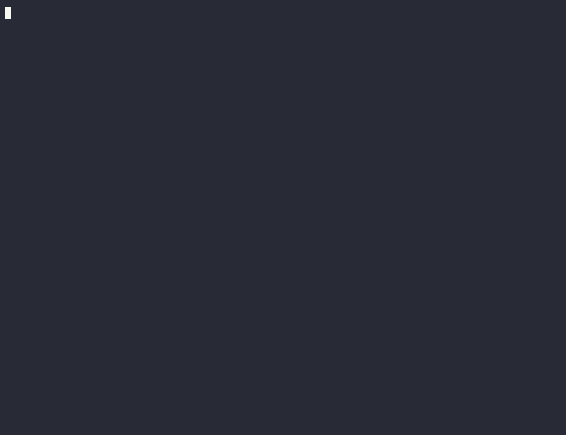
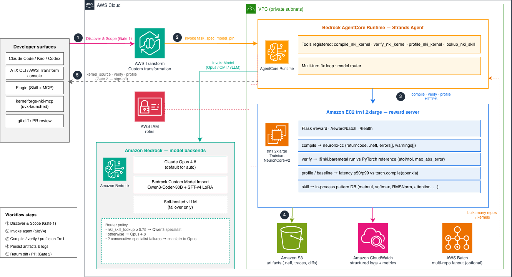

# ATX Custom NKI Agent

**Migrate PyTorch and Triton kernels to AWS Trainium NKI — verified on real silicon.**

A custom [AWS Transform](https://aws.amazon.com/transform/) agent (packaged as an Agent Plugin: Skill + MCP) that turns a PyTorch `nn.Module` or `@triton.jit` kernel into an `@nki.jit` [NKI](https://awsdocs-neuron.readthedocs-hosted.com/en/latest/general/nki/index.html) kernel — then **compiles, numerically verifies, and profiles every candidate on a real Trainium device** before opening a PR with the evidence. Nothing is claimed that wasn't measured on hardware.

> Most Trainium migrations stall on one file: a hand-tuned custom kernel a generic tool won't safely rewrite (a wrong rewrite silently corrupts results; a slow one defeats the point). This agent closes that gap.

## Demo



A real recording of a hand-written **CUDA RMSNorm** kernel migrated through the
full chain — **atx CLI → skill (SKILL.md) → MCP tools → AgentCore runtime → Trn1
reward server**. The agent generates the `@nki.jit` kernel via the deployed
runtime's multi-turn fix loop, and it **compiles, verifies (max_abs_error
2.1e-4, 0 / 16.7M elements mismatched), and profiles at 544 µs median** on a real
`trn1.2xlarge`. Full walkthrough in
[`examples/cuda_rmsnorm_migration/`](examples/cuda_rmsnorm_migration/).

## Why a loop, not just a model

Asked to write an NKI kernel with **no tools**, Claude Opus 4.8 solves **6%** of the 150-task NKIGen-Bench subset. The *same model* in a **compile-verify-fix loop** on real Trainium **compiles 83%** and **numerically verifies 88%** of the tasks whose weights the kernel can see.

| Configuration | Rate |
|---|---|
| Claude Opus 4.8, single-shot (no tools) | 6.0% (9 / 150) |
| Claude Opus 4.8 + NKI agent loop, as published ([Tang et al., DL4C @ ICML 2026](https://arxiv.org/abs/2607.04395)) | 77.3% (116 / 150) |
| Claude Opus 4.8 + NKI agent loop, this repo — compiled on device | **83.3% (125 / 150)** |
| Claude Opus 4.8 + NKI agent loop, this repo — numerically verified (weight-free subset) | **87.7% (50 / 57)** |

Last two rows are a fresh run of the released agent, reporting both compilation and on-device verification (`np.allclose`, atol = rtol = 1e-3). Tasks with learned weights not passed to the kernel are scored on compilation — see [`results/`](results/).

## Architecture



One MCP server is the contract; every surface (Claude Code / Kiro / Codex, the `atx` CLI, AWS Transform console, AWS Batch) is a client, and the model backends + Trn1 reward server sit behind it. The AgentCore runtime runs a multi-turn fix loop — `discover → skill_lookup → generate → compile → verify → profile` — behind two human gates (Scope, Requirements). Full design in [docs/architecture.md](docs/architecture.md).

**Two lessons generalize to any custom agent:** (1) make the MCP server the contract, so surfaces/backends change without forking the agent; (2) put real ground truth in the loop — every candidate is validated on a real device, which is what turns a 6% model into an 83%-compiling one.

```
Discovery → Scope (Gate 1) → Assessment → Requirements (Gate 2) → Tasks → Execute → Diff/PR
```

- **Gate 1 (Scope)** — the user picks which kernels to convert and the model backend.
- **Gate 2 (Requirements)** — the user signs off the accuracy + performance budget.
- **Execute** — per kernel: `skill_lookup → generate → compile → verify → profile`; on failure the compiler error or numerical divergence is fed back and the kernel is retried.

**Two design rules carry the most weight, and generalize to any custom agent:**

1. **Make the MCP server the contract.** Surfaces and backends change underneath it without forking the agent.
2. **Put real ground truth in the loop.** Every candidate is validated on a real device, not a simulator — the same reward path used to score generations during RL training. An agent that can check its own work against reality is what turns a 6% model into an 83%-compiling, 88%-verified one.

### Pluggable model backends

A small router in AgentCore picks per task; customers can pin a backend (default is `auto`):

- **Claude Opus 4.8** (Bedrock) — default for `auto` and novel/off-distribution kernels. Inherits every new Claude release for free. **This is the only backend provisioned in the current deployment**, and all published results here are Opus 4.8.
- **Bedrock Custom Model Import** — Qwen3-Coder-30B-A3B + SFT-v4 LoRA merged. Specialist for in-distribution NKI shapes; cheaper per token. Routed when `nki_skill_lookup` scores ≥ 0.75. *Not provisioned in this deployment* — the router wiring exists (set `QWEN_CMI_ARN`), but no CMI model is imported, so it is never selected.
- **Self-hosted vLLM** — failover only. *Not provisioned in this deployment* (set `VLLM_ENDPOINT` to enable).

> **Current deployment: Opus-4.8-only.** The Qwen3-Coder + SFT-v4 CMI and the vLLM failover are designed-in and can be added later without changing the agent — the router already knows how to route to them — but neither is wired up today. Two consecutive specialist failures escalate to Opus, carrying the compiler error forward (relevant once a specialist backend is provisioned).

## Repository layout

```
ATX-nki-agent/
├── .claude-plugin/             Claude Code plugin manifest
├── .codex-plugin/              Codex plugin manifest
├── .kiro/                      Kiro-native config (settings/mcp.json + steering/)
├── .mcp.json                   MCP server descriptor (uvx --from ./mcp)
├── atx/                        AWS Transform (atx) CLI surface: transformation
│                                definition + ~/.aws/atx/mcp.json entry
├── skills/nki-kernel/          Skill: SKILL.md + references/ (steering)
├── mcp/                        kernelforge-nki-mcp Python package (7 tools)
├── infrastructure/             Everything that gets deployed to AWS — see
│                                docs/deployment-architecture.md for the full map
│   ├── agentcore/               Strands Agent + model router + AgentCore deploy
│   ├── agentcore_cdk/           CDK scaffold for the AgentCore runtime
│   ├── reward_server/           Trn1 Flask service (compile / verify / profile / baseline)
│   └── reward_server_cdk/       CDK stack that provisions the Trn1 from scratch
├── nkibench/                   NKIGen-Bench task registry (Level 1/2/3)
├── results/                    Recorded on-device measurement runs
├── docs/                       Architecture diagram + design docs
├── examples/                   Sample kernels + transcripts
└── scripts/                    Local dev / eval / smoke tests
```

## The seven MCP tools

| Tool | Backend | Purpose |
|---|---|---|
| `nki_discover_kernels` | local repo walk | Find `@triton.jit` and hot `nn.Module.forward` |
| `nki_generate_kernel` | AgentCore endpoint | Multi-turn agentic generation |
| `nki_compile` | Trn1 reward server | `neuronx-cc` compile |
| `nki_verify` | Trn1 reward server | `np.allclose` on real device |
| `nki_profile` | Trn1 reward server | latency p50/p99 + utilization |
| `nki_skill_lookup` | in-package skill DB | NKI patterns / recipes |
| `nki_emit_diff` | local repo write | Generate patch / open PR |

## Prerequisites

- An AWS account with access to **Claude on Amazon Bedrock** in `us-east-1`.
- An EC2 quota for at least one **`trn1.2xlarge`** in `us-east-1`.
- Permissions to create **AgentCore Runtime endpoints**, an **IAM role** for the AgentCore service, and a **VPC security group** scoped to the client CIDRs that need the reward port.
- The **`atx` CLI** ([AWS Transform](https://docs.aws.amazon.com/transform/latest/userguide/custom-get-started.html); `curl -fsSL https://transform-cli.awsstatic.com/install.sh | bash`) and **`agentcore` CLI** (Bedrock AgentCore) on your developer machine — only needed for the ATX-CLI surface and deploy, respectively.
- **Node 18+ and the AWS CDK** (`npm i -g aws-cdk`) to provision the reward server via `infrastructure/reward_server_cdk/`.
- Python 3.12+ with `uv`/`uvx` for the MCP server, and any MCP-aware agent (Claude Code, Kiro, or Codex are tested).

## Install (end users)

The agent is one MCP server with multiple client surfaces. Pick the one that
matches how you work — both drive the same seven tools.

**IDE / agent (Claude Code, Kiro, Codex):**

```bash
/plugin marketplace add <your-marketplace>
/plugin install kernel-forge-aws-transform
```

Kiro consumes the same MCP server natively (the repo ships `.kiro/settings/mcp.json`). Then, in your IDE: *"Convert this Triton softmax kernel to NKI for Trainium."*

> **The MCP server is launched from this repo, not from PyPI.** `kernelforge-nki-mcp`
> is not published on public PyPI, so every launcher config here passes
> `uvx --from <path>` — `.mcp.json` uses `${CLAUDE_PLUGIN_ROOT:-.}/mcp` (the plugin
> directory when installed via `/plugin`, the repo root otherwise),
> `.kiro/settings/mcp.json` uses `./mcp` relative to the Kiro workspace, and
> `atx/mcp.json` takes an absolute path. If you write your own config, keep the
> `--from`: `uvx` resolves bare names from public PyPI, so a bare
> `uvx kernelforge-nki-mcp` would let anyone who registers that name run code
> inside your agent process, with its file access, AWS credentials and tool
> permissions.

**AWS Transform (`atx`) CLI:** the `atx` CLI does not use `/plugin` — it runs a
**transformation definition** and reads its MCP servers from `~/.aws/atx/mcp.json`.
This repo ships both artifacts under [`atx/`](atx/):

```bash
curl -fsSL https://transform-cli.awsstatic.com/install.sh | bash   # installs the `atx` binary
sed "s#REPLACE_WITH_ABSOLUTE_PATH#$(pwd)#" atx/mcp.json > ~/.aws/atx/mcp.json
atx mcp tools -s kernelforge-nki-mcp                   # confirm atx sees the 7 tools
atx custom def exec -p ./examples/cuda_rmsnorm_migration \
  --configuration "additionalPlanContext=Follow atx/transformation-definition/transformation_definition.md"
```

Full ATX steps (publishing the definition to your account registry, running by
name, non-interactive/CI usage) are in [`atx/README.md`](atx/README.md).

**The seven MCP tools:** `nki_discover_kernels`, `nki_generate_kernel`, `nki_compile`, `nki_verify`, `nki_profile`, `nki_skill_lookup`, `nki_emit_diff`.

## Deploy the full stack

Everything is provisioned declaratively — no hand-built AMIs, no manual SSH.
Two ways to run it — `make` (recommended) or the underlying `cicd/` shell
scripts directly; both do exactly the same thing, since every Makefile target
is a thin dispatch to a script:

```bash
make deploy                                # confirms each of the 4 stages
CICD_YES=1 make deploy                     # unattended (no prompts) — same as CI

# calling the script directly instead of via make — identical behavior:
CICD_YES=1 ./cicd/deploy.sh --region us-east-1
```

`make deploy`/`cicd/deploy.sh` orchestrates all four steps below in one command
(AgentCore-first, so its execution role ARN is known before the reward server
stack deploys — see [`cicd/README.md`](cicd/README.md) for the full ordering
rationale). It bootstraps the account/region's single default
CDK toolkit stack (`CDKToolkit`, qualifier `hnb659fds`) once and every CDK app
in this repo deploys on top of it, resolves AgentCore's execution role ARN
automatically, and wires the two deploys together in the right order. The
steps below are what it does internally, for reference — and as the direct
shell-command alternative if you want to run a single step by hand:

**1. Deploy AgentCore.** Creates the Bedrock AgentCore Runtime and its
execution role. Bootstraps
`infrastructure/agentcore_cdk/atxnkiagent/agentcore/cdk/`'s environment first
— a plain `cdk bootstrap` against the account/region's default `CDKToolkit`.
A dedicated qualifier isn't worth it here: `agentcore deploy`'s own internal
CDK invocation always targets the default qualifier regardless of what this
project's `cdk.json` declares, so pinning a custom one only bought a second,
unused toolkit stack.

```bash
cd infrastructure/agentcore_cdk/atxnkiagent/agentcore/cdk
npm install && ./node_modules/.bin/cdk bootstrap
cd ..
# First time only — registers the runtime resource in agentcore.json (this
# file is gitignored on purpose; agentcore create/deploy alone does not
# populate it for a bring-your-own-code agent). Call the binary by its full
# path, not a bare `agentcore` — node_modules/.bin/ only exists under cdk/,
# one level below the project root this must run from:
cdk/node_modules/.bin/agentcore add agent \
  --name nki_agent --type byo --language Python --framework Strands \
  --model-provider Bedrock --code-location ../../agentcore/ \
  --entrypoint app.py --network-mode PUBLIC --protocol HTTP \
  --authorizer-type AWS_IAM
cdk/node_modules/.bin/agentcore deploy --yes
```

**2. Reward server (Trn1) — CDK, no gateway.** Launches a stock
Neuron DLAMI, installs the reward server from a bundled S3 asset, and runs
it under systemd. AgentCore reaches it directly over SG-to-SG networking —
no API Gateway, no IAM grant to attach.

```bash
cd infrastructure/reward_server_cdk
npm install && npx cdk bootstrap
npx cdk deploy
```

**3. Point AgentCore back at the reward server — automated.** Reads the
stack outputs (`RewardUrlPrivate`, `AgentCoreClientSgId`, `VpcSubnets`),
patches `REWARD_SERVER_URL` and the VPC network config into `agentcore.json`,
and redeploys the runtime in place; no manual editing of config. Gated on the
reward server's SSM bootstrap status, so it never wires up a half-provisioned
server. Skipping this step leaves `REWARD_SERVER_URL` at its committed
placeholder and the runtime fails fast with `RewardServerNotConfiguredError`.

```bash
# from infrastructure/reward_server_cdk (where step 2 left you)
./repoint-agentcore.sh --region us-east-1
```

**4. Run the benchmark** against the live reward path:

```bash
cd ../.. && bash scripts/rerun_blog_results_opus48.sh
```

See [`infrastructure/reward_server_cdk/README.md`](infrastructure/reward_server_cdk/README.md) for options
(instance type, AZ, ingress CIDRs, SSH) and teardown.

**Tear down** everything the same way — `make destroy` (or `./cicd/destroy.sh`
directly), confirmation-gated the same way as deploy:

```bash
make destroy                     # confirms each stage
CICD_YES=1 make destroy          # unattended
CICD_YES=1 ./cicd/destroy.sh --region us-east-1   # same, direct script call
```

## Develop locally

You do **not** need a GPU or Trainium instance for the developer flow — all
Trainium-touching work happens on the reward server.

```bash
# MCP server
cd mcp && uv pip install -e .
uvx --from . kernelforge-nki-mcp
```

The `--from .` is not optional shorthand: `kernelforge-nki-mcp` is not published
to public PyPI, and a bare `uvx kernelforge-nki-mcp` would resolve that name
from public PyPI — letting whoever registers it execute code inside the agent
process. Every launcher config here (`.mcp.json`, `.kiro/settings/mcp.json`,
`atx/mcp.json`) pins a path for the same reason.

**Run the tests** across the MCP tools, model router, reward-server input
validation + auth, the diff path-traversal guard, and the end-to-end chain,
from the repo root:

```bash
make prep                       # installs deps for every sub-project, then runs the suite
# or, calling the pieces directly:
pip install flask pytest        # test-only deps (Neuron not required)
pytest                          # discovers infrastructure/{reward_server,agentcore}, mcp, tests suites
```

The suite is hardware-free by design: reward-server tests exercise the
validation/auth branches without touching the Neuron toolchain.

### End-to-end integration test

`tests/test_integration_chain.py` walks the whole migration chain that a real
request traverses:

```
atx CLI → skill (SKILL.md) → MCP tools → AgentCore runtime → Trn1 reward server
```

It runs in two tiers. The **hardware-free tier** (always on) pins the
`atx → skill → MCP` links: the plugin manifest / `.mcp.json` / `SKILL.md`
wiring, kernel discovery (including hand-written **CUDA custom kernels**),
skill-DB lookup, and the diff/path-traversal guard. The **live on-device tier**
pins `MCP → AgentCore → reward server` by generating a kernel and asserting the
reward server **compiled and numerically verified it on a real Trainium
device** — the ground-truth link the whole design rests on:

```bash
NKI_LIVE=1 \
AGENTCORE_ARN=arn:aws:bedrock-agentcore:us-east-1:<acct>:runtime/<runtime-id> \
AWS_REGION=us-east-1 \
pytest tests/test_integration_chain.py -v
```

Proven on Opus 4.8 against a live `trn1.2xlarge`: the CUDA→NKI RMSNorm
migration in [`examples/cuda_rmsnorm_migration/`](examples/cuda_rmsnorm_migration/)
**compiled** and **verified correct** on device (`max_abs_error ≈ 2.1e-4`,
0 / 16.7M elements mismatched at `atol = rtol = 1e-3`), median latency 544 µs.

The reward server runs under gunicorn with 4 workers (`-w 4`), enforced by
the systemd unit the CDK stack installs: earlier revisions ran `-w 1` because
the persisted NEFF cache was written to a filename derived only from
`kernel_name`, which could collide across concurrent requests. `compile.py`
now writes each successful compile's persisted NEFF under a per-request
UUID-suffixed filename, so multiple workers can run concurrently without
that collision risk.

### Live smoke test against the deployed stack

`make smoke-live` exercises the real compile-verify-profile loop against
whatever is already deployed — the same real, billed Bedrock + Trainium calls
as the integration test's live tier, packaged as a two-tier pass/fail gate
instead of a single pytest case. It resolves the AgentCore runtime ARN
automatically (same `list-agent-runtimes` lookup `cicd/deploy.sh` uses), so
no manual ARN export is required after a `make deploy`:

```bash
make smoke-live                              # fast smoke (1 task) + full CUDA->NKI migration
CICD_YES=1 make smoke-live                   # unattended
SKIP_MIGRATION=1 make smoke-live             # fast smoke only, skip the full migration
# or, calling the script directly instead of via make — identical behavior:
CICD_YES=1 ./cicd/smoke-live.sh --region us-east-1
CICD_YES=1 ./cicd/smoke-live.sh --region us-east-1 --skip-migration
```

This does **not** create or destroy any infrastructure — it only invokes what
`make deploy` already provisioned. It creates/destroys nothing, but every run
makes real Bedrock model calls and real `neuronx-cc`/NeuronCore work on the
Trn1, so it is not free and not instant (the fast tier finishes in well under
a minute; the full migration tier can take several).

## Reference

Junjie Tang, Jun Huan, Hao Zhou, Yuhao Zhang, and Lin Wang. *NKI-Agent: Domain-Specific
Fine-Tuning and Agentic Tool Use for Neuron Kernel Generation.* DL4C (Deep Learning for
Code) Workshop at ICML 2026. <https://arxiv.org/abs/2607.04395>

## Security

See [CONTRIBUTING](https://github.com/aws-samples/sample-ATX-custom-NKI-Agent/blob/main/CONTRIBUTING.md#security-issue-notifications)
for more information. Please do not create a public GitHub issue for security findings.

## License

This library is licensed under the MIT-0 License. See the [LICENSE](LICENSE) file.
