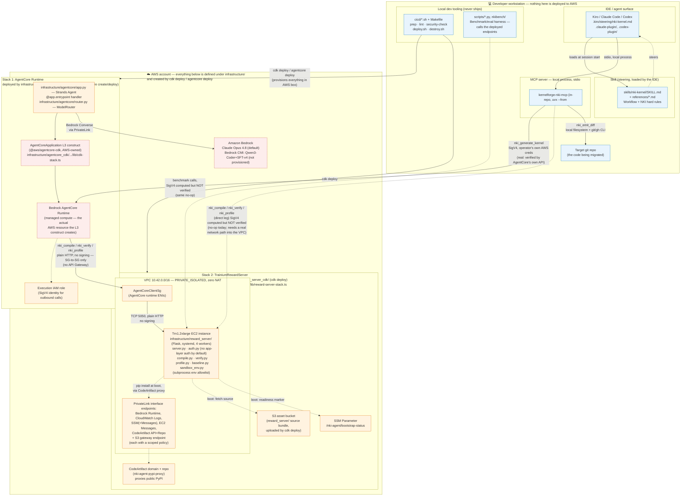

# ATX NKI Agent — Solution Architecture

Maps every software component to (a) where it *runs* — developer workstation vs. AWS
— and (b) the exact file/directory in this repo that defines it. Two CDK apps deploy
the AWS side; everything else stays local. Everything that gets deployed to AWS lives
under `infrastructure/`; everything else in the repo is workstation-only.



## Legend

- **Blue** — runs on the developer's own machine. Nothing in this group is ever
  uploaded to AWS as infrastructure; the MCP server is *launched* locally (via `uvx`)
  even though it calls out to AWS services.
- **Orange** — infrastructure this repo's own code defines and CDK provisions, all
  under `infrastructure/` (`infrastructure/reward_server_cdk/`,
  `infrastructure/agentcore_cdk/`) — you can read every line of what gets created.
- **Red/dashed** — AWS-managed resources created *by* the orange layer's CDK code, but
  whose internals live in AWS-owned packages (`@aws/agentcore-cdk`'s L3 construct,
  Bedrock itself) — this repo configures them, doesn't implement them.
- **Dotted edges into `TRN1`** mark the MCP-direct calls whose SigV4 signature is
  computed but not verified by anything today — solid edges are either
  genuinely verified (AgentCore's own `InvokeAgentRuntime` API) or gated purely
  by network/security-group position, not by a signature.

## Component → deployment-target map

| Component | Runs on | Defined in | Deployed by |
|---|---|---|---|
| IDE/agent (Kiro, Claude Code, Codex) | Workstation | `.claude-plugin/`, `.codex-plugin/`, `.kiro/` | N/A — installed by the developer |
| Skill (steering doc) | Workstation (loaded into the IDE's context) | `skills/nki-kernel/SKILL.md` + `references/` | N/A — ships with the plugin/`.kiro/` |
| MCP server | Workstation (local process, `uvx`-launched) | `mcp/src/kernelforge_nki_mcp/` | `uvx --from <repo>/mcp kernelforge-nki-mcp` (in-repo, never bare-name/PyPI) — not CDK |
| `agentcore/app.py` (Strands agent code) | **AWS** — packaged and shipped into the AgentCore Runtime | `infrastructure/agentcore/app.py`, `infrastructure/agentcore/router.py` | `infrastructure/agentcore_cdk/atxnkiagent/` via `agentcore deploy` |
| AgentCore Runtime (managed compute) | **AWS** | AWS-owned (`@aws/agentcore-cdk`'s `AgentCoreApplication` L3 construct) | Same — `agentcore create`/`agentcore deploy` |
| AgentCore CDK wrapper stack | **AWS** (defines the stack; resources are AWS-managed) | `infrastructure/agentcore_cdk/atxnkiagent/agentcore/cdk/lib/cdk-stack.ts` | `agentcore deploy` (runs CDK under the hood) |
| Reward server app code | **AWS** — runs on the Trn1 instance | `infrastructure/reward_server/*.py` | `infrastructure/reward_server_cdk/` via `cdk deploy` (bundled as an S3 asset, installed at boot) |
| VPC, Trn1 instance, NLB, API Gateway, PrivateLink endpoints, CodeArtifact, S3 asset bucket | **AWS** | `infrastructure/reward_server_cdk/lib/reward-server-stack.ts`, `bin/app.ts`, `bootstrap/user-data.sh` | `cdk deploy` (via `cicd/deploy.sh`/`make deploy`) |
| Bedrock (Claude Opus 4.8, optional CMI) | **AWS**, AWS-managed service | N/A — configured via env vars/model IDs in `infrastructure/agentcore/app.py` | N/A — Bedrock itself is not deployed, only invoked |
| `cicd/*.sh`, `Makefile` | Workstation (or CI runner) | `cicd/` | N/A — these *drive* the two deploys above, they aren't deployed themselves |
| `scripts/*.py`, `nkibench/` (benchmark/eval harness) | Workstation | `scripts/`, `nkibench/` | N/A — calls the already-deployed reward server/AgentCore endpoints |
| Target repository being migrated | Workstation (or wherever `nki_emit_diff` points) | N/A — customer's own repo | N/A |

## `infrastructure/`: everything that gets deployed to AWS

```
infrastructure/
├── agentcore/            App code shipped into the AgentCore Runtime
├── agentcore_cdk/        CDK app that deploys the AgentCore Runtime
├── reward_server/        App code that runs on the Trn1 instance
└── reward_server_cdk/    CDK app that provisions the Trn1/VPC/API Gateway stack
```

Everything else in the repo — `mcp/`, `skills/`, `cicd/`, `scripts/`, `nkibench/`,
`.kiro/`, the plugin manifests — stays on the developer's workstation and is never
deployed as AWS infrastructure.

## The two CDK apps, and why there are two

- **`infrastructure/agentcore_cdk/atxnkiagent/`** — an `agentcore create`-scaffolded
  project. Its `agentcore/cdk/` subdirectory wraps AWS's own `@aws/agentcore-cdk` L3
  constructs; `agentcore deploy` synthesizes and deploys it. This is the AgentCore
  Runtime side.
- **`infrastructure/reward_server_cdk/`** — a hand-written CDK app (no
  `@aws/agentcore-cdk` dependency) that provisions the Trn1 reward server's full
  network stack from scratch: VPC, security groups, the EC2 instance itself, and
  every PrivateLink endpoint. Deployed with a plain `cdk deploy`. The AgentCore
  runtime reaches the reward server directly over SG-to-SG networking on port
  5050 (see `reward_server_cdk/README.md`); there is no NLB or API Gateway in
  this stack, since the security-group rule is the access control.

`cicd/deploy.sh` orchestrates both, AgentCore-first, then wires them together via
`infrastructure/reward_server_cdk/repoint-agentcore.sh` — see that script and
`cicd/README.md`'s "Deploy ordering" section for the exact sequencing and why
(AgentCore's REWARD_SERVER_URL / VPC network config isn't known until AFTER
the reward server exists, so AgentCore is deployed first and repointed at it
afterward, in place; access between the two stacks is gated by security
groups, with no IAM grant to sequence around).

There are, at the time of writing, two AgentCore deployment *paths* in this repo with
no single declared canonical one — `infrastructure/agentcore_cdk/atxnkiagent/` (used
by `cicd/deploy.sh` and shown above) and `infrastructure/agentcore/deploy.sh` (an
older, npm/pip-CLI-distinction-dependent fallback). Which one to keep is an open
decision.
